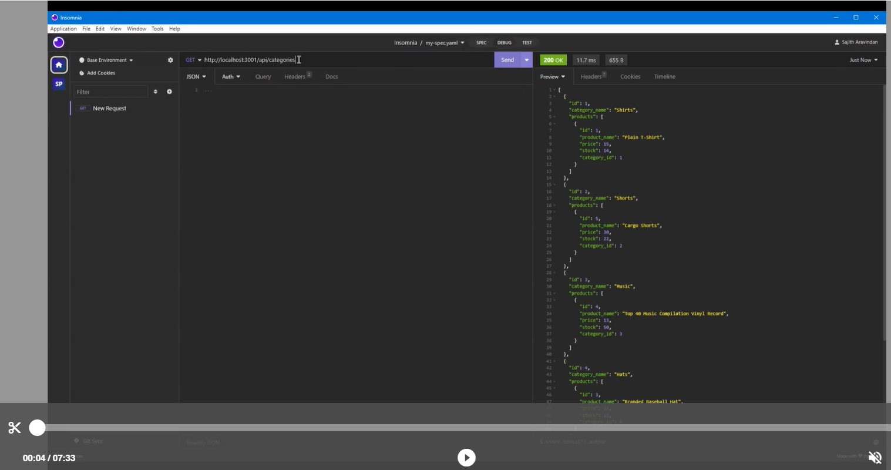

# E-commerce Application

## Description
This is a command-line content management systems (CMS) application to manage a company's employee Details. This application will enable  non-developers to easily manage and interact with information stored in databases.

User Story & Acceptance Criteria follow the AS AN / I WANT / SO THAT format.


## Table of Contents 
  
   * [User Story](#User-Story) 
  
   * [Acceptance Criteria](#Acceptance-Criteria)
  
   * [Technologies Used](#Technologies-Used) 
  
   * [Usage](#Usage) 

   * [Installation](#Installation) 

   * [Demo](#Demo) 

   * [Review](#Review) 
  
   * [License](#license) 


## User Story
AS A manager at an internet retail company
* I WANT a back end for my e-commerce website that uses the latest technologiesy
    SO THAT my company can compete with other e-commerce companies


## Acceptance Criteria

GIVEN a functional Express.js API

* WHEN I add my database name, MySQL username, and MySQL password to an environment variable file
    THEN I am able to connect to a database using Sequelize
* WHEN I enter schema and seed commands
    THEN a development database is created and is seeded with test data
* WHEN I enter the command to invoke the application
    THEN my server is started and the Sequelize models are synced to the MySQL database
* WHEN I open API GET routes in Insomnia Core for categories, products, or tags
    THEN the data for each of these routes is displayed in a formatted JSON
* WHEN I test API POST, PUT, and DELETE routes in Insomnia Core
    THEN I am able to successfully create, update, and delete data in my databas


## Technologies Used
Node.js, Express.js, Sequelize and MySQL.


## Usage
A command-line application that at a minimum allows the user to:

* Add 
    *  departments
    *  roles
    *  employees
* View 
    *  departments
    *  roles
    *  employees
    *  employees by manager
    *  employees by department
    *  total utilized budget of a department
* Update 
    *  employee's roles
    *  employee's managers
* Delete 
    *  departments
    *  roles
    *  employees


## Installation
* This application need node.js, please refer to [offical website](https://nodejs.org/en/download/) for installation
* download this repo by running
    ```bash
    git clone https://github.com/SajithAravindan/Employee-Tracker_NjEjMS.git
    ```
* This application also need to install mysql on your computer, please refer to [mysql website](https://www.mysql.com/downloads/) for installation
* Change connection credentials in ```connection.js``` to your root/user/password of your mysql DBMS.
* install required node pacakges by running
    ```bash
    npm install
    ```
* Create schema of database tables by running all the queries in ```schema.sql```
* Set up test records yourself or run queries in ```seed.sql```
* start the application by running
    ```
    node index
    ```
  
## Demo

[](https://drive.google.com/file/d/1ZFNPltmG4_qYzewmWywe_d9tOJ1Gy1UR/view)


Demo Video Link: https://drive.google.com/file/d/1ZFNPltmG4_qYzewmWywe_d9tOJ1Gy1UR/view


## License
* Please refer to the LICENSE in the repo. <a href="https://github.com/SajithAravindan/readme-generator-NJS/blob/main/LICENSE">(MIT License)</a>


---

Copyright (c) 2023 SajithAravindan.

